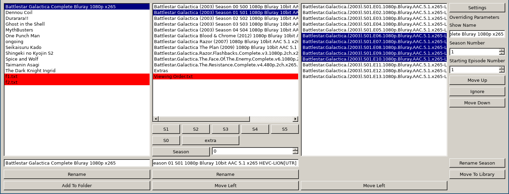

# simplifiedVideoLibraryRenamer

Makes it a bit simpler to get your Tv Shows named for simple parsing by other applications such as Plex or Kodi/XBMC.

After downloading a show from various sources, the files typically will have odd labels and junk in the titles. This program makes it simpler to have very different title structures that you can still mass rename properly. It is simpler to use than a general mass renaming tool since it is specificly for the structure of Tv Shows. You can use it either directly on your video library folder, or have an import folder and later move shows to your library.

* Usage centers around the three lists - Tv Shows - Seasons - Episodes
* First Hightlight the items in a list and then click on an action under that list
* Highlight multiple items in the list using the standard Ctrl/Shift + Mouse
* Even Faster Highlight by dragging the mouse over several entries

* Left List - Tv Shows
  * Rename uses the entry box to give the new name to the last highlighted item
  * Add To Folder makes a new folder with the name given and moves selected items into that folder
  * Rename can merge folders if you tell it the name of folder already there
* Middle List - Seasons
  * Highlight the comon items that go in the same season
  * Use the buttons below to put them in a folder (eg "Season 1")
* Right List - Episodes
  * Highlight items that are not in proper order (Top being lowest number)
  * Use the buttons to the right (Move Up/Down) to change their order
  * The settings on the right are used for renaming and numbering
* Bottom Right Corner
  * Rename Season will rename all files in the current season (eg "Show Name.s01.e01.mkv")
  * Move To Library will move the current Show to the designated library location